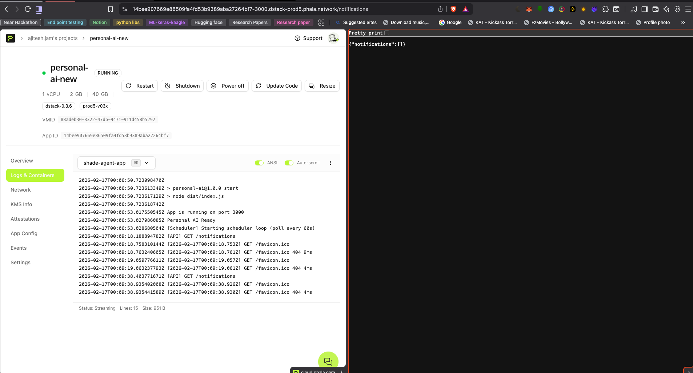

# Eve and WallE: The Verifiable Life-Ops Protocol 🛡️🤖

Welcome to **Eve and WallE**, the first "Meta-Agent Factory" designed for the decentralized world. Eve and WallE empowers non-technical users to deploy **Shade Agents**—autonomous, private, and verifiable AI assistants—into secure hardware enclaves (TEEs) using nothing but natural language.

Our flagship agent, **WallE**, acts as your "Confidential Life-Ops Manager": share secrets, schedule payments, get financial advice. Building such agents from scratch is difficult for non-coders—so we built **Eve**, the Master Agent, which deploys your own personal AI assistants (and more) in just a few prompts.

presentation : https://gamma.app/docs/Eve-Wall-E--b5ckr3n9umby63o

---

## Table of Contents

- [The Core Philosophy](#-the-core-philosophy-why-eve-and-walle)
- [Why Shade Agents?](#-why-shade-agents)
- [Architecture Overview](#-architecture-overview)
- [Meet the Agents](#-meet-the-agents)
- [Python Shade Agents](#-python-shade-agents)
- [Will Executor (Deep Dive)](#-will-executor-deep-dive)
- [Live Demos](#-live-demos)
- [Getting Started](#-getting-started)
- [Environment Variables](#-environment-variables)
- [API Reference](#-api-reference)
- [Security](#️-security-note)

---

## 🚀 The Core Philosophy: Why Eve and WallE?

In a world of centralized AI, privacy is a myth. To have an AI manage your life, you usually have to "donate" your soul to a server. **Eve and WallE changes the game.**

| Principle                 | What It Means                                                                                                                                                                                        |
| ------------------------- | ---------------------------------------------------------------------------------------------------------------------------------------------------------------------------------------------------- |
| **Trustless Autonomy**    | You don't trust us (the developers). You trust the **Hardware Enclave (TEE)** and the **Verifiable Code Hash**. The agent can only run the code you approved.                                        |
| **Privacy-First Compute** | Your keys, medical logs, passwords, and will details never leave the secure CPU. Even if the physical server is hacked, your data remains encrypted in memory.                                       |
| **Persistent Execution**  | Unlike a chatbot, these agents live on the **Phala Network**. They keep working—monitoring your will, tracking trades, paying bills, checking social activity—long after you close your browser tab. |
| **"Can't Be Evil"**       | Because the deployment is verifiable on-chain, the agent can only execute the logic you deployed. No backdoors, no front-running, no rug pulls.                                                      |

---

## 🛡️ Why Shade Agents?

Building a life-ops AI that you can trust requires **Shade Agents**—agents that run inside Trusted Execution Environments (TEEs) on the Phala Network. Here is why both WallE and Eve need to be Shade Agents:

| Concern                    | Why Shade Agents Solve It                                                                                                                                                                                                |
| -------------------------- | ------------------------------------------------------------------------------------------------------------------------------------------------------------------------------------------------------------------------ |
| **Trust in the deployer**  | You cannot trust the deploying authority (us) to deploy only your code. With Shade Agents, you trust the **TEE** and the **verifiable code hash**—the enclave can only execute the attested code.                        |
| **Keys and secrets**       | You share NEAR keys, API keys, and passwords. These must **never go through a centralized server**. Shade Agents receive secrets at deploy time; they are decrypted only inside the TEE and never leave the secure CPU.  |
| **Proprietary logic**      | For trading algos, custom strategies, or confidential logic you don't want anyone to see, we offer **custom tool support**. Your alpha stays inside the enclave; RPC nodes and competitors cannot front-run or steal it. |
| **WallE: Secrets & funds** | WallE holds your secrets and manages your funds. It needs to be a Shade Agent so your data remains encrypted in memory. _(Future: private inference to keep your secrets completely secret during LLM calls.)_           |

---

## 🏗️ Architecture Overview

The project is organized into three main layers:

```
┌─────────────────────────────────────────────────────────────────┐
│  Master Agent (Forge) - backend/ + frontend/                     │
│  Orchestrates deployment of Shade Agents via natural language    │
└──────────────────────────────┬──────────────────────────────────┘
                               │ deploys
         ┌─────────────────────┼─────────────────────┐
         ▼                     ▼                     ▼
┌─────────────────┐  ┌─────────────────┐  ┌─────────────────┐
│  WallE          │  │  Will Executor  │  │  Custom Agents  │
│  (personal_ai)  │  │  (will_executor_agent) │  │  (AI-generated)   │
│  Confidential   │  │  Proof-of-Life  │  │                 │
│  Life-Ops       │  │  Dead Man Switch│  │                 │
└────────┬────────┘  └────────┬────────┘  └────────┬────────┘
         │                    │                    │
         └────────────────────┼────────────────────┘
                              ▼
                    Phala Network (TEE)
                    dStack - Secure Enclave
```

- **Master Agent (Eve / Forge):** A Python FastAPI backend + React frontend. You describe your agent in natural language; Eve selects tools, generates code, and deploys to Phala dStack. Designed for non-coders—deploy your personal AI in prompts.
- **WallE (Personal AI):** Confidential RAG (Knowledge Base), notifications, scheduled events, chat, add-data. Runs inside a TEE. Holds your secrets and manages your funds.
- **Will Executor:** A programmable "Dead Man's Switch"—monitors Proof-of-Life (YouTube, Gmail, etc.) and autonomously distributes assets to beneficiaries when you go silent.
- **Crypto Trading Agent:** _(In progress.)_ Deploy custom trading algos into a TEE; your strategy stays secret and unfront-runnable.

---

## 🤖 Meet the Agents

### 1. WallE (Your Personal AI Assistant)

The ultimate digital vault with a brain. WallE manages your **Confidential RAG** (Knowledge Base) and handles high-stakes tasks.

**Capabilities:**

- **Confidentiality:** "WallE, what is my Netflix password?" or "WallE, here is my private medical log for today."
- **Financial Agency:** "WallE, schedule my rent payment for the 1st of every month using my NEAR wallet."
- **Privacy-Preserving Advice:** Get spending insights without a bank seeing your data.
- **Notifications & Scheduling:** Stores scheduled events and notifications, with a background scheduler that moves due events into your notification queue.

**Why Shade Agent:** WallE holds your secrets and manages your funds. Your keys and data never leave the TEE. _(Future: private inference to keep your secrets completely secret during LLM calls.)_

**Tech:** TypeScript, Hono, `data.json` for personal data, scheduler loop polling every 60 seconds.

---

### 2. Eve (The Master Agent / Forge)

Building agents from scratch is hard for non-coders. **Eve** lets you deploy your own Shade Agents in natural language prompts. It can deploy:

- **Personal AI assistants** (like WallE)
- **Will Executor** — a one-liner: _Monitors your Proof-of-Life (YouTube, Gmail, etc.) and autonomously executes your will to distribute assets to beneficiaries when you go silent._
- **Crypto trading agents** _(in progress)_ — deploy proprietary trading logic into a TEE.

Eve uses a human-in-the-loop (HITL) workflow: you describe your intent, Eve suggests tools, you review, and it generates and deploys the agent.

---

### 3. The Will Executor (Proof-of-Life) — See [Deep Dive](#-will-executor-deep-dive)

A "Dead Man's Switch" for the 21st century. It monitors your "Proof of Life" (YouTube, Gmail, Twitter, Instagram) and autonomously executes your will to distribute assets to beneficiaries if you go silent.

---

### 4. The Crypto Trading Agent (Proprietary Alpha)

A trading bot where the **strategy is the secret**. Deploy custom algorithms into a TEE so that RPC nodes and competitors can't front-run your logic or steal your alpha. _(In progress.)_

---

## 🐍 Python Shade Agents

We also build **Python Shade Agents** using `shade-agent-py` (Phala's Python SDK). These run inside TEEs and use `agent_view` / `agent_call` to interact with on-chain contracts.

- **Will Executor** — Available in TypeScript (`will_executor_agent`) and can be deployed via Eve. Uses social APIs (YouTube, Gmail, etc.) for Proof-of-Life checks.
- **python-dao-agent** — A Python Shade Agent that polls for pending proposals, votes via AI, and submits votes to the contract. Demonstrates `shade-agent-py` for autonomous on-chain actions.

---

## 📜 Will Executor (Deep Dive)

The Will Executor is an autonomous agent that runs continuously inside a TEE. It implements a **Proof-of-Life** mechanism: if you do not show recent activity on specified social platforms within a configurable time window, it assumes you are unable to act and executes your will.

### How It Works

1. **Configure Your Will:** Define beneficiaries (NEAR account IDs and percentage splits), social media accounts to monitor, and an inactivity threshold (e.g., 30 days).
2. **Continuous Loop:** The agent sleeps for a configurable interval (bounded by your smallest social window in days), then wakes up.
3. **Proof-of-Life Check:** For each configured social account, it fetches the latest activity timestamp (e.g., last YouTube upload, last Gmail sent, last tweet). If **any** account shows activity within the grace period, the agent assumes you are alive and goes back to sleep.
4. **Execution Trigger:** If **all** monitored accounts show no recent activity beyond the grace period, the agent executes the will.
5. **Payout:** It distributes NEAR from the agent's vault (or a fixed `targetAmountYocto`) to beneficiaries according to their split percentages, via `pay_by_agent` from `@neardefi/shade-agent-js`.

working demo: https://www.youtube.com/watch?v=BBRtAD0hobM

### Will Entry Structure

The will is represented by a `will_entry` object with the following fields:

| Field                           | Type                                       | Description                                                                                                                             |
| ------------------------------- | ------------------------------------------ | --------------------------------------------------------------------------------------------------------------------------------------- |
| `willText`                      | string                                     | Human-readable description of the will conditions (e.g., "When I go silent for 30 days, distribute assets to beneficiaries").           |
| `executor`                      | string                                     | NEAR account ID of the executor (the agent owner).                                                                                      |
| `beneficiaries`                 | `{ accountId: string, split: number }[]`   | List of NEAR accounts and their percentage split (e.g., `50` = 50%). Splits are normalized; total can sum to 100 or any positive value. |
| `socialMediaAccounts`           | `{ platform, username, timePeriodDays }[]` | Accounts to monitor for Proof-of-Life.                                                                                                  |
| `sleepSeconds`                  | number                                     | Minimum interval (in seconds) between inactivity checks. Capped by the smallest `timePeriodDays` (in seconds) among social accounts.    |
| `targetAmountYocto`             | string \| undefined                        | Optional fixed amount (in yoctoNEAR) to distribute. If omitted, the agent uses its vault balance.                                       |
| `createdAtISO` / `updatedAtISO` | string                                     | ISO timestamps for auditing.                                                                                                            |

**Supported Platforms:**

- **YouTube** — Uses YouTube Data API (channel ID or handle). Checks latest upload/activity.
- **Gmail** — Uses Gmail API with OAuth. Checks latest sent email.
- **Twitter** — Uses Twitter API v2. Checks latest tweet.
- **Instagram** — Uses Instagram Graph API. Checks latest post.

Environment variables (e.g., `GOOGLE_API_KEY`, `GMAIL_CLIENT_ID`, `GMAIL_CLIENT_SECRET`, `GMAIL_REFRESH_TOKEN`, `TWITTER_BEARER_TOKEN`, `INSTAGRAM_ACCESS_TOKEN`) are required for the platforms you enable.

### Will Executor API

| Method | Endpoint                            | Description                    |
| ------ | ----------------------------------- | ------------------------------ |
| GET    | `/will`                             | Get current will configuration |
| POST   | `/will`                             | Overwrite entire will          |
| PATCH  | `/will`                             | Partially update will          |
| POST   | `/will/beneficiaries`               | Add or update a beneficiary    |
| PATCH  | `/will/beneficiaries/:accountId`    | Update beneficiary by ID       |
| DELETE | `/will/beneficiaries/:accountId`    | Remove beneficiary             |
| POST   | `/will/socials`                     | Add or update a social account |
| PATCH  | `/will/socials/:platform/:username` | Update social account          |

### Payout Logic

- Total amount is either `targetAmountYocto` or `agentViewBalance()` (vault).
- Beneficiaries receive amounts proportional to their `split` values.
- Precision is handled with integer math (10,000 units) to avoid floating-point errors.
- Payouts are executed sequentially via `pay_by_agent` on the Shade Agent contract.

---

## 🔗 Live Demos

- **Deployed WallE Agent:** [https://14bee907669e86509fa4fd53b9389aba27264bf7-3000.dstack-prod5.phala.network](https://14bee907669e86509fa4fd53b9389aba27264bf7-3000.dstack-prod5.phala.network)
- **Presentation Prompt:** See [`PRESENTATION_PROMPT.md`](PRESENTATION_PROMPT.md) for a full prompt to generate hackathon/demo slides with any presentation AI.
- **Project Dashboard:** [nearhackathon.vercel.app](https://nearhackathon.vercel.app)

### Proof of Deployment

The WallE agent is live on **Phala Network's dStack**, running in a Trusted Execution Environment (TEE):



_Screenshot: Phala dStack dashboard showing the personal-ai-new agent in RUNNING state with logs (e.g., `Personal AI Ready`, `[Scheduler] Starting scheduler loop`, `[API] GET /notifications`). The `/notifications` endpoint returns `{"notifications":[]}`—confirming the API is reachable and healthy._

---

## 🛠️ Getting Started

### Prerequisites

- Node.js 18+
- Python 3.10+
- (Optional) Docker for Phala deployment

### 1. Master Agent (The Factory)

Orchestrates deployment of your agents.

**Backend:**

```bash
cd backend
python -m venv venv
source venv/bin/activate   # Windows: venv\Scripts\activate
pip install -r requirements.txt
uvicorn main:app --port 8000 --reload
```

**Frontend:**

```bash
cd frontend
npm install
npm run dev
```

Set `GOOGLE_API_KEY` or `GEMINI_API_KEY` in `.env` for AI-assisted agent generation.

### 2. WallE (Personal AI)

**Agent Backend:**

```bash
cd personal_ai
npm install
cp .env.development.local.example .env.development.local   # if available
npm run dev
```

**Agent Frontend:**

```bash
cd personal_ai_frontend
npm install
npm run dev
```

Configure the backend URL (e.g., `http://localhost:3000` or your Phala dStack URL) in the frontend.

### 3. Will Executor Agent

**Backend:**

```bash
cd will_executor_agent
npm install
# Set env: NEAR_*, GOOGLE_API_KEY, GMAIL_*, TWITTER_BEARER_TOKEN, INSTAGRAM_ACCESS_TOKEN
npm run dev
```

### 4. Deploy to Phala (WallE)

```bash
cd personal_ai
npm run phala:deploy
# Or: npm run phala:image && npm run phala:only
```

Ensure `NEAR_SEED_PHRASE` and other secrets are set in your environment; they are encrypted before deployment and decrypted only inside the TEE.

---

## ⚙️ Environment Variables

### Backend (Master Agent / Forge)

| Variable                             | Description                                                                      |
| ------------------------------------ | -------------------------------------------------------------------------------- |
| `GOOGLE_API_KEY` or `GEMINI_API_KEY` | **Required.** Used for AI-assisted agent generation (LLM).                       |
| `OPENROUTER_API_KEY`                 | Optional alternative for LLM.                                                    |
| `NEXT_PUBLIC_contractId`             | NEAR contract ID (e.g. `ac-sandbox.[account].testnet` for Phala Cloud).          |
| `NEAR_ACCOUNT_ID`                    | NEAR account for deployment.                                                     |
| `NEAR_SEED_PHRASE`                   | Seed phrase (encrypted before deploy; never sent to our servers).                |
| `NEAR_CONTRACT_CODEHASH`             | On-chain code hash for verification.                                             |
| `API_CODEHASH`                       | Shade Agent API code hash (fixed).                                               |
| `PHALA_API_KEY`                      | Phala Cloud API key ([dashboard](https://cloud.phala.network/dashboard/tokens)). |
| `DOCKER_TAG`                         | Docker Hub image tag (e.g. `username/agent-name`).                               |

Create `.env` or `.env.development.local` in `backend/`.

---

### Frontend (Master Agent)

| Variable       | Description                                              |
| -------------- | -------------------------------------------------------- |
| `VITE_API_URL` | Backend API base URL (default: `http://localhost:8080`). |

Create `.env` or `.env.development.local` in `frontend/`.

---

### personal_ai (WallE Agent)

| Variable                             | Description                                                       |
| ------------------------------------ | ----------------------------------------------------------------- |
| `GEMINI_API_KEY` or `GOOGLE_API_KEY` | **Required.** LLM for chat.                                       |
| `NEAR_ACCOUNT_ID`                    | NEAR account.                                                     |
| `NEAR_SEED_PHRASE`                   | Seed phrase (decrypted only in TEE).                              |
| `NEXT_PUBLIC_contractId`             | `ac-proxy.[account]` for local, `ac-sandbox.[account]` for Phala. |
| `API_CODEHASH`                       | Shade Agent API code hash.                                        |
| `APP_CODEHASH`                       | Your app's code hash (from `shade-agent-cli`).                    |
| `DOCKER_TAG`                         | Docker image (e.g. `username/personal-ai-new`).                   |
| `PHALA_API_KEY`                      | For Phala deployment.                                             |

Create `.env.development.local` in `personal_ai/`.

---

### personal_ai_frontend (WallE UI)

| Variable                | Description                                                                                      |
| ----------------------- | ------------------------------------------------------------------------------------------------ |
| `VITE_AGENT_API_TARGET` | Phala-deployed agent URL (avoids CORS; e.g. `https://[app-id]-3000.dstack-prod5.phala.network`). |

The frontend can also set the backend URL at runtime (Setup page) and persists it in `localStorage` under `agent_backend_url`.

---

### will_executor_agent (Will Executor)

| Variable                                                              | Description                                     |
| --------------------------------------------------------------------- | ----------------------------------------------- |
| `NEAR_ACCOUNT_ID`                                                     | NEAR account.                                   |
| `NEAR_SEED_PHRASE`                                                    | Seed phrase.                                    |
| `NEXT_PUBLIC_contractId`                                              | `ac-proxy.[account]` or `ac-sandbox.[account]`. |
| `API_CODEHASH`                                                        | Shade Agent API code hash.                      |
| `APP_CODEHASH`                                                        | App code hash.                                  |
| `DOCKER_TAG`                                                          | Docker image.                                   |
| `PHALA_API_KEY`                                                       | For Phala deployment.                           |
| `GOOGLE_API_KEY`                                                      | For AI (if used).                               |
| `GMAIL_CLIENT_ID`, `GMAIL_CLIENT_SECRET`, `GMAIL_REFRESH_TOKEN`       | Gmail API for Proof-of-Life.                    |
| `YOUTUBE_CLIENT_ID`, `YOUTUBE_CLIENT_SECRET`, `YOUTUBE_REFRESH_TOKEN` | YouTube API.                                    |
| `TWITTER_BEARER_TOKEN`, `INSTAGRAM_ACCESS_TOKEN`                      | Social APIs (if enabled).                       |

Create `.env.development.local` in `will_executor_agent/`.

---

### python-dao-agent (Python Shade Agent)

Same NEAR/Phala vars as above. Uses `shade-agent-py` for `agent_view` / `agent_call`. In production, the agent waits until it is registered (checksum available) before starting the responder loop.

---

## 📡 API Reference

### WallE (Personal AI)

| Method | Endpoint                       | Description                                              |
| ------ | ------------------------------ | -------------------------------------------------------- |
| GET    | `/`                            | Health check (`{"status":"ok","service":"personal-ai"}`) |
| GET    | `/health`                      | Same as `/`                                              |
| POST   | `/chat`                        | Send message; returns streaming/text response            |
| GET    | `/notifications`               | List notifications                                       |
| POST   | `/notifications/:id/respond`   | Approve/reject/dismiss notification                      |
| GET    | `/scheduled-events`            | List scheduled events                                    |
| POST   | `/scheduled-events/:id/reject` | Reject a scheduled event                                 |
| POST   | `/add-data`                    | Add/merge personal data (`field`, `value`)               |

### Will Executor

See [Will Executor API](#will-executor-api) above.

---

## 🛡️ Security Note

All deployments through Eve and WallE are sent directly to **Phala Network's dStack**. Your `NEAR_SEED_PHRASE`, API keys, and will data are encrypted before deployment and are only ever decrypted inside the hardware-level security of a Trusted Execution Environment (TEE). The agent runs in an attested enclave; the code hash is verifiable on-chain.

---

> _"We are moving from 'Don't be evil' to 'Can't be evil'. Your life, your data, your agent."_
